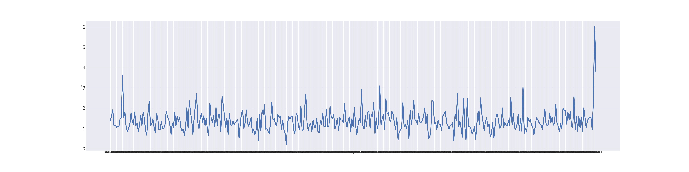
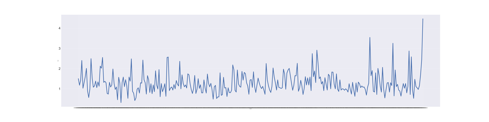
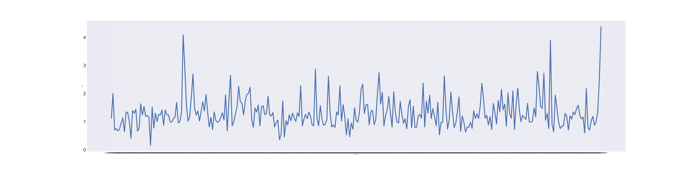
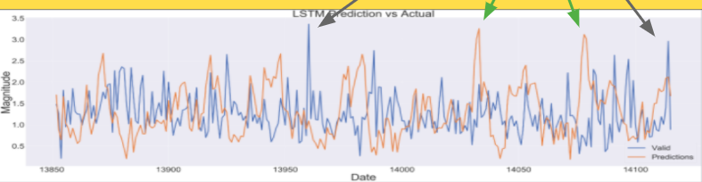

# EarthquakeProject 

REPOSITORY STRUCTURE
- FinalNB.ipynb
- ExtraModels.ipynb is where I tested my model on a different subset of my scraped data. This notebook also contains a model testing on a different geographic location
- modelJ.h5 copy is the saved model
 
Business Case
- The SF/Bay Area is home to the San Andreas fault and 6 others making it an active earthquake belt. Forecasting earthquakes so the area can prepare, will minimize injuries, and save economic/financial losses due to property damage. 

Data Acquisition and Preprocessing
- Used usgs.gov query tool to return data from 1.1.10-8.2.20 of earthquakes with magnitude > 0.1 into a .csv file. Data collected included 14,116 points with 22 columns. The coordinates of the given area is (38.46 to 37.23 latitude, and -121.40 to -123.01 longitude. The query tool can be found [here] (https://earthquake.usgs.gov/earthquakes/search/)
- Data Preprocessing included converting time series data into datetime format
- The actual time series will consist of the datetime and magnitude of the quake. The dependent variable is the quake magnitude.

EDA
- Description of the only major earthquake in the area in the last 10 years with a 6.0 magnitude.  The Napa Earthquake took place on 8.24.14 3:20pm local time. Below is the seismic data of the earthquake 2 months before leading up to quake.

- From the analysis I generated a null hypothesis. The null hypothesis is there is no difference in seismic activity 2 weeks prior to an earthquake versus 2 months prior. 
- I then analyzed quakes next biggest which were 4.0 quakes and there were 8 of them in 10 years. Below were 2 of the 6 quakes I analyzed.

- From these graphs, the null hypothesis was rejected and concluded that the seismic activity right before a feelable quake is higher than normal. This was done thru comparing the variance in seismic data 2 weeks before quake to mean local variance (variance 2 months before quake).

Modeling
 - Three models were compared but 4 models were tested. The tested models included SARIMA, SARIMAX, ARIMA, LSTM. The three models compared were the baseline model, ARIMA, and LSTM with LSTM being our best model. 
 
 
- Our best model (green arrows) and the gray arrows show that quakes were forecasted but in different times. They are similar in magnitude. This means our model can forecast earthquakes within a given timeframe. The graph contains 2 months of data. Training data of 10 months was used for this model.The time difference between the two quakes are two weeks so the timeframe for our forecast accuracy is plus/minus two weeks. 
- This model was an LSTM neural network with 2 100 node layers + a dense layer and 4000 epochs with a 130 batch size. 
- RMSE and SMAPE metrics were used to evaluate our model because SMAPE tells us the mean absolute percentage error (up and down) telling us how often our predictions were correct. RMSE tells us how off our line plot is from the source. 

CONCLUSION
- Earthquake forecasting using time series data was effective using the  LSTM model. It was able to effectively forecast an important earthquake within a reasonable time frame. EDA helped us identify earthquake precursors. A vanilla RNN was not effective nor (S)ARIMA(X) models. 
- For further investigation, I would investigate into foreshocks and aftershocks and try our model on unseen data. A more complex LSTM with stronger processors could be used for the LSTM model in the future. But most importantly, the model needs to generalizable and not overfit while maintaining a good SMAPE score. And also raw seismic data with more regular intervals could be tried.

CITATIONS:
- LSTM Model https://youtu.be/QIUxPv5PJOY
- usgs.gov query tool for data source https://earthquake.usgs.gov/earthquakes/search/
- Slide Illustrations
 SAN ANDREAS FAULT LINE https://geology.com/articles/san-andreas-fault.shtml
- RICHTER SCALE 
https://www.alamy.com/search.html?qt=richter%20scale%20earthquake&imgt=0
- TRANSFORM FAULT ILLUSTRATION https://layerofearthwordpresscom.wordpress.com/transform-plate-boundaries/
- COSTS OF EARTHQUAKES
https://www.kansascityfed.org/publications/research/oke/articles/2016/economic-damage-large-earthquakes

PRESENTATION LINK:
https://docs.google.com/presentation/d/1pIqk5-NN86szZGaZgWNKM681LFEsrW0e_aU3tUp7fM4/edit#slide=id.g8f59c23fc9_0_111

